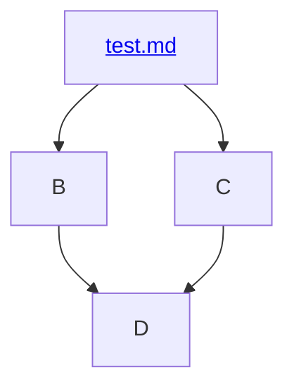

# Undergraduate Physics

A course of study that models a typical undergraduate physics program.

This project encapsulates the high-level undergraduate physics program being followed in my learning journey. The vast majority of the curriculum comes from Susan Rigetti's excellent guide [So You Want to Learn Physics…
SECOND EDITION](https://www.susanrigetti.com/physics). I will also add in additional resources from other guides, etc.

