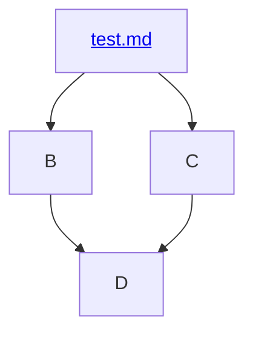

# Undergraduate Physics

This project encapsulates the high-level undergraduate physics program being followed in my learning journey. 
> [!NOTE]
> The vast majority of the curriculum comes from Susan Rigetti's excellent guide - [So You Want to Learn Physics…
SECOND EDITION](https://www.susanrigetti.com/physics).
>
> Additional resources from other guides will be added as needed.

### Example of using a Mermaid.js chart to link to other internal Markdown documents.

