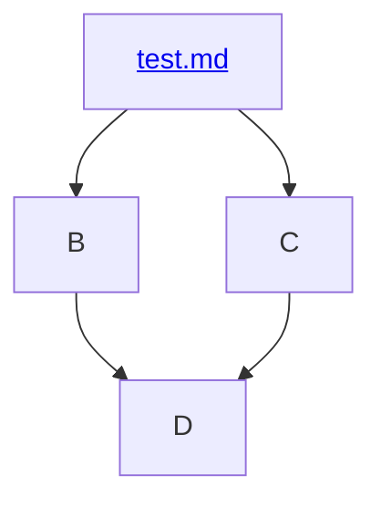

# physics-undergrad
An undergraduate physics study program.

```mermaid
flowchart TD;
    A["<a href='https://github.com/mikeclymer/physics-undergrad/blob/main/test.md'>test.md</a>"]-->B;
    A-->C;
    B-->D;
    C-->D;
```
